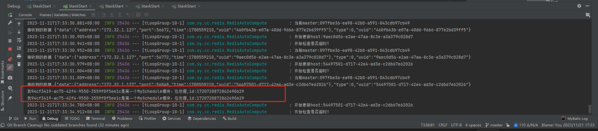

## schedule task (Stask)

### 轻量级去中心化定时任务，项目解决无中心的分布式定时任务执行，避免中心节点故障问题。在spring boot 2.7.17 和 spring boot 3.1.0 下测试通过
```
通过创建 Netty的组播,第一次随机生产一个 master。
```
### 引入包

```
 <dependency>
      <groupId>com.sy.cc</groupId>
      <artifactId>stask-basic</artifactId>
       <version>1.0-SNAPSHOT</version>
  </dependency>          
```

### 项目支持去中心hazelcast和reids做缓存。

### hazelcast:
```

       <dependency>
            <groupId>com.sy.cc</groupId>
            <artifactId>stask-hazelcast</artifactId>
            <version>1.0-SNAPSHOT</version>
        </dependency>
```

### reids:
```
        <dependency>
            <groupId>com.sy.cc</groupId>
            <artifactId>stask-redis</artifactId>
            <version>1.0-SNAPSHOT</version>
        </dependency>
```


###  stask.yaml
```
staskServer:
  address:  225.2.2.2
  port: 5678
  type: multicast  #目前只支持multicast
  idleTime: 6
  check:
    type: http  #(http,udp)
  cache:
    server: true
    type: redis  #(hazelcast,redis)
    redis:
#      host: 192.168.1.179
#      port: 51369
      url: 192.168.1.179:51369
      #password:
      password: zysoft
      expire: 18000
#      type: redis (redis,rediss) 默认redis
```
### 开启服务 
```
@EnableStask
@MapperScan(basePackages = {"com.sy.cc.mapper", ...})
```


### 根据zy_sys_job表（zy_sys_job.sql） 执行分配   
```
添加执行类 并注入到spring boot 中，如：
@Component(value = "MySchedule")
public class MySchedule {


    public void getHandleTest(String arg) {

        System.out.println(String.format("我%s是第一个MySchedule模块，在处理,id:%s", Identity.getUUID(),arg));
    }

}

clazz_name字段为类名字 =MySchedule
clazz_method方法名=getHandleTest
```


### 5个服务执行情况
### master

### 其他执行者



