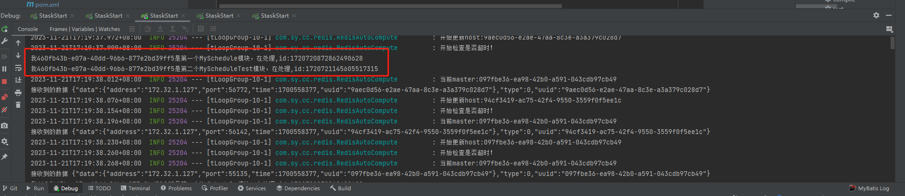
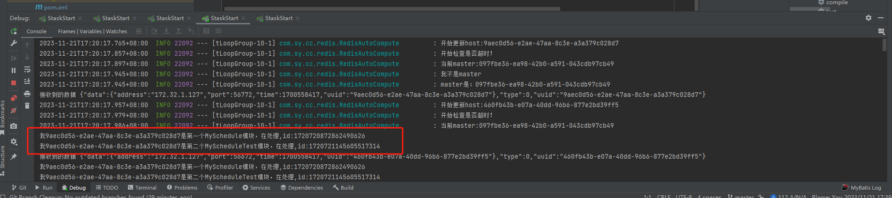
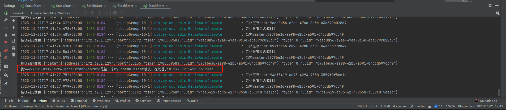

## schedule task (Stask)

### Lightweight decentralized scheduled tasks  (Stask), the project solves the issue of executing distributed scheduled tasks without a central node, thus avoiding problems related to central node failure. The solution has been tested successfully under spring boot 2.7.17 and spring boot 3.1.0.
```
By creating Netty's multicast, a master is randomly selected for the first time. The master is responsible for distributing newly requested scheduled tasks and, in the event of a change in the network group, redistributing the already distributed scheduled tasks.
Each task executor synchronizes its assigned tasks every 5 seconds, determining whether to run the task. If it's not running, it starts the task directly. If it's already running, it checks if the task content has changed. If there's a change, the previous task is stopped and restarted. If the task doesn't belong to the executor, it's ignored.
Every 6 seconds, a heartbeat is sent to the multicast group. Upon receiving the heartbeat, the time of receipt is added or updated. If there is no update for 18 seconds (3 times), it is considered dead, and the task processing group is removed. The network group is marked as changed, and it's checked if the dead node was the master. 
If not, it's ignored. If it was the master, the dead master is replaced with the current node, and after waiting for 1 second, once the master is stable, it's confirmed that the master is now the current node. The network is checked for changes, and as the master change is considered a network change, the already distributed tasks are reallocated according to the current network group.
This way, even if the server's network is disconnected from others, the final task distribution will be reassigned to the current node. When the network is restored, the network group is changed, and regardless of who the current master is, the tasks are redistributed according to the current network group, achieving decentralized task distribution.
```
### 引入包

```
 <dependency>
      <groupId>com.sy.cc</groupId>
      <artifactId>stask-basic</artifactId>
       <version>1.0-SNAPSHOT</version>
  </dependency>          
```

###  The project supports decentralized caching using Hazelcast and Redis.

### hazelcast:
```

       <dependency>
            <groupId>com.sy.cc</groupId>
            <artifactId>stask-hazelcast</artifactId>
            <version>1.0-SNAPSHOT</version>
        </dependency>
```

### reids:
```
        <dependency>
            <groupId>com.sy.cc</groupId>
            <artifactId>stask-redis</artifactId>
            <version>1.0-SNAPSHOT</version>
        </dependency>
```


###  stask.yaml
```
staskServer:
  address:  225.2.2.2
  port: 5678
  type: multicast  #supports multicast
  idleTime: 6
  check:
    type: http  #(http,udp)
  cache:
    server: true
    type: redis  #(hazelcast,redis)
    redis:
#      host: 192.168.1.179
#      port: 51369
      url: 192.168.1.179:51369
      #password:
      password: zysoft
      expire: 18000
#      type: redis (redis,rediss) 默认redis
```
### Start the service 
```
@EnableStask
@MapperScan(basePackages = {"com.sy.cc.mapper", ...})
```


### 根据zy_sys_job表（zy_sys_job.sql） 执行分配   
```
Add an execution class and inject it into Spring Boot" translates to "Add an execution class and inject it into Spring Boot
@Component(value = "MySchedule")
public class MySchedule {


    public void getHandleTest(String arg) {

        System.out.println(String.format("My %s this is frsit  MySchedule mode,id:%s", Identity.getUUID(),arg));
    }

}

clazz_name  =MySchedule
clazz_method =getHandleTest
```


### The execution status of 5 service
### master

### other



